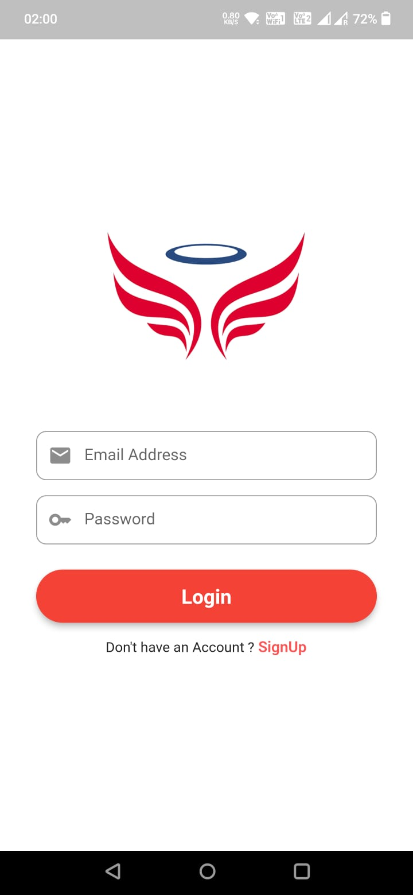
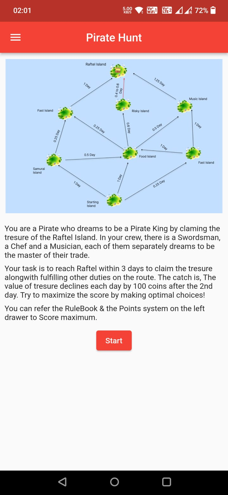

# Pirate Hunt

Pirate Hunt is a project developed on Flutter & Dart as the assignment for the 2nd round of eLitmus. Pirate Hunt is a simple yet clever game to test one's most essential soft skill required in an organization i.e Leadership. 

The puzze follows a series of clues / islands that the user ( as Pirate ) has to visit alongside his crew members ( swordsman, musician and a chef) in order to maximize the profit he can earn while getting his hands on the tresure.  Each decision you take, Each route you take to reach the Treasure Island credits you different gold coins as your score.

It's a must play! You run you nerves, fight your score against your friends on the leaderboard :) 

## A note to the Evaluator

I'm really sorry I couldn't submit you the website instead I'm submitting this android/app fulfilling all the requirements you mentioned for the website. Ideally I am not a web developer instead I am a full stack app developer. The reason I am writing you this note is because I would really be thankful if you considered this app as my assignment. I know front-end web development and moving towards being a full stack web developer by my interview or joining as an intern. I learnt app dev from 0 to top and would do the same in web dev too. I I promise to be a full stack web developer by my joining ( if selected for further rounds ). Thank you eLitmus. I made this app from scratch to fulfill the requirements and would be happy if considered :)

## Soft skill to be Assessed 

LeaderShip ! Leadership is one of the most essential soft skill required in the industry in order to lead your team to fulfill org's goals on time with maximum performance. This puzzle tests you up on various aspects of Leadership like :
- Leader must see the wellfare of the organization first then his personal needs
- Leader must achieve goals by deadline
- A leader sets the morale of his team, he cares about the needs on an individual of the team

## Possible ways to solve the Puzzle

There are numerous routes that you can take up with each route getting you to a different amount of treasure.

- The most optimistic way is to reach the treasure Island Raftel while fulfilling you crew members dreams on the way ::
This way is optimistic as in an organization one would always expect a leader to deliver on time as well as take care of his teammates and set their morale up.

- The least optimal way is to take up fast routes that would save you time but won't let you take away the maximum prize ::
This way is the least optimal as such leaders who just hurry to complete a goal cannot look into the future and at the same time pull down the morale of the team while making them work harder then before.

- There's a hidden way to reach the treasure island that let's you have the greatest treasure of all time through the Risky Island ( but make sure, it's a RISKY one ).

## Feature List (Must Have)
 
✅ Anyone with an email address can create an Id and password to participate in the game

✅ The puzzle must contain

- ✅ Minimum 5 clues
- ✅ Minimum 2 dead-ends
- ✅ Minimum 1 solution 
- ✅ All the progress / user data (eg - time taken by each user for every step, solution accuracy, etc.) depending on your puzzle requirements should be stored for every user

❌ On refreshing, from either browser or website, the puzzle should start from the same step or give the user an option to restart

✅ A dashboard for the admin where the progress of all the users can be tracked & analyzed

## Additional Requirements
 
❌ User analytics (eg - time taken by each user for every step, solution accuracy, etc.) depending on your puzzle should be stored and shown in the admin dashboard

❌ Data analysis using different graphs or tables

✅ User Leaderboard

## ScreenShots of the Application 

 | | |
 | | |
 | |

## Setting up

This project is a Flutter application.

A few resources to get you started if this is your first Flutter project:

- [Lab: Write your first Flutter app](https://docs.flutter.dev/get-started/codelab)
- [Cookbook: Useful Flutter samples](https://docs.flutter.dev/cookbook)

For help getting started with Flutter development, view the
[online documentation](https://docs.flutter.dev/), which offers tutorials,
samples, guidance on mobile development, and a full API reference.
